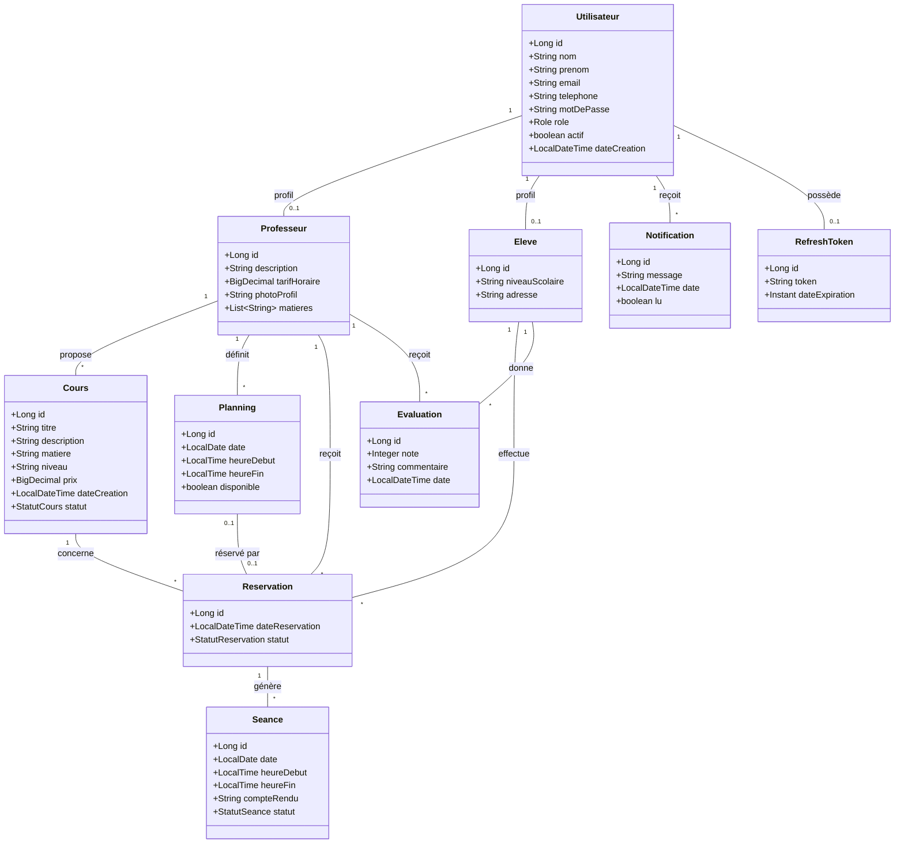
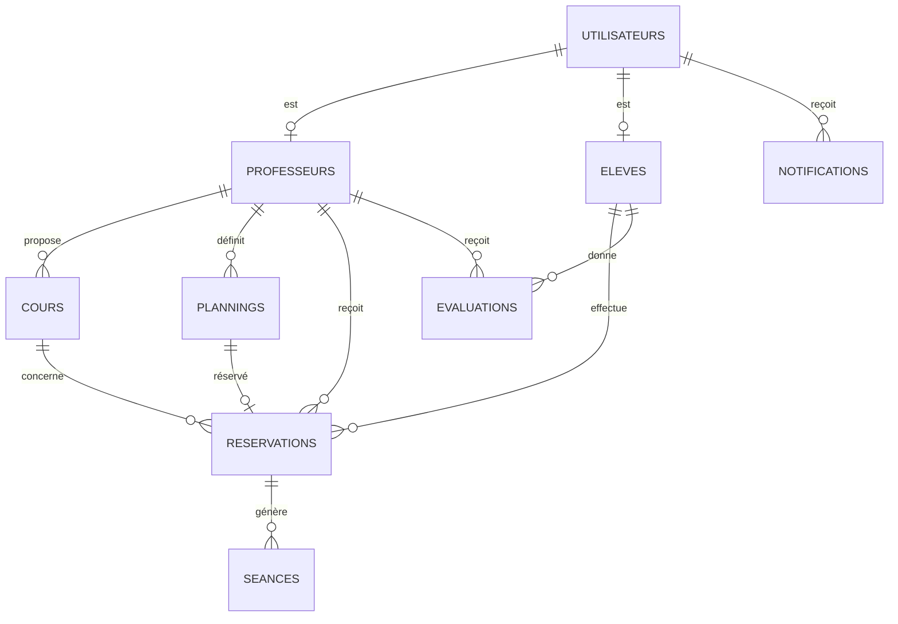

# Diagramme de Classes UML

## Diagramme de classes (Mermaid)

## Relations JPA

| Relation | Type | Description |
|----------|------|-------------|
| Utilisateur ↔ Professeur | OneToOne | Profil professeur |
| Utilisateur ↔ Eleve | OneToOne | Profil élève |
| Professeur → Cours | OneToMany | Un professeur propose plusieurs cours |
| Professeur → Planning | OneToMany | Disponibilités du professeur |
| Professeur → Reservation | OneToMany | Réservations reçues |
| Eleve → Reservation | OneToMany | Réservations effectuées |
| Cours → Reservation | OneToMany | Réservations pour un cours |
| Planning ↔ Reservation | OneToOne | Créneau réservé |
| Reservation → Seance | OneToMany | Séances d'une réservation |
| Eleve/Professeur → Evaluation | ManyToOne | Évaluations |
| Utilisateur → Notification | OneToMany | Notifications in-app |

## Diagramme entité-relation (simplifié)

